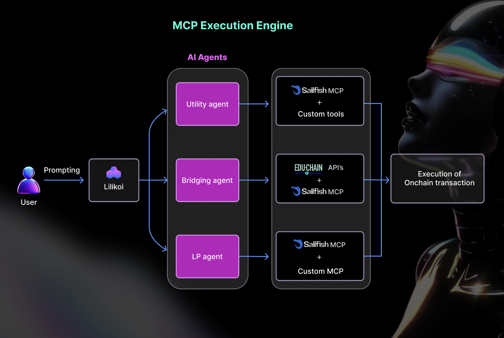

# Lilikoi  - Your AI-Powered DeFi Brain

[.svg>)](https://example.com)

<!-- Replace with actual logo path and link if applicable -->

> Simplify DeFi. Interact with AI agents using natural language to stake, bridge, swap, and manage assets effortlessly.

Lilikoi is a Next.js application featuring a suite of AI agents designed to streamline complex DeFi operations on EVM chains, primarily focusing on EDU Chain and Arbitrum. Users interact via a chat interface, giving natural language commands to specialized agents.

## ✨ Key Features

- **Natural Language Interface:** Chat with agents using plain English commands.
- **Agent-Based Architecture:** Specialized agents handle specific DeFi tasks:
  - **Bridging Agent:** Facilitates bridging EDU tokens between Arbitrum (L2) and EDU Chain (L1).
    - Example Commands: "Bridge 100 EDU from Arbitrum to EDU Chain", "Withdraw bridged EDU on EDU Chain", "Approve bridge to spend 50 EDU"
  - **Transaction Agent:** Enables sending native EDU or specific ERC20 tokens.
    - Example Commands: "Send 5 EDU to 0x123...", "Transfer 20 Arbitrum EDU token to my friend 0xabc..."
  - **DEX Agent:** Handles swaps, wrapping/unwrapping EDU/WEDU, and price quotes on the EDU Chain DEX (SailFish).
    - Example Commands: "Swap 0.1 EDU for USDC", "Wrap 10 EDU", "Get a quote for swapping 50 USDC to WEDU"
  - **Utility Agent:** Provides information about tokens, pools, balances, etc.
    - Example Commands: "What is the price of EDU?", "Show my USDC balance", "What are the top tokens by TVL?", "Get info on the EDU/USDC pool"
- **Multi-Step Tool Use:** The backend orchestrates sequences of actions (e.g., Quote → Balance Check → Prepare Swap).
- **Agent Thinking Visualization:** The chat interface displays the sequence of tools called.
- **Wallet Integration:** Connects with wallets (e.g., MetaMask) via ConnectKit/Wagmi.
- **Homepage Dashboard:** Displays simulated "Lilikoi Score", recent activity, agent links.
- **Modern Frontend:** Next.js App Router, React, TypeScript, Tailwind CSS.

## 🏛️ Architecture Overview


_User prompts Lilikoi, which routes the request to the appropriate AI Agent (Utility, Bridging, LP). The agent uses relevant tools (Sailfish MCP, EDU-CHAIN APIs, Custom Tools/MCP) via the MCP Execution Engine to prepare and execute on-chain transactions._

## 🛠️ Tech Stack

- **Framework:** Next.js 14+ (App Router)
- **Language:** TypeScript
- **Styling:** Tailwind CSS
- **AI/LLM:** Anthropic Claude 3 Haiku (via API)
- **Wallet Connection:** ConnectKit, Wagmi
- **Blockchain Interaction:** Ethers.js (via Wagmi), custom `agentKit` library, custom `BridgeMCP` library
- **State Management:** React Hooks (`useState`, `useEffect`, `useCallback`)

## 🚀 Getting Started

Follow these instructions to set up and run the project locally.

### Prerequisites

- **Node.js:** Version 18.x or later recommended.
- **Package Manager:** `npm` or `yarn`.
- **Web3 Wallet:** A browser extension wallet like MetaMask installed.
- **API Keys:** You'll need keys for Anthropic and an RPC provider (see Configuration).

### Installation

1.  **Clone the repository:**

    ```bash
    git clone <your-repository-url>
    cd lilikoi-educhain-hack
    # Or your actual project directory name
    ```

2.  **Install dependencies:**
    ```bash
    npm install
    # or
    pnpm install
    ```

### Configuration

1.  **Create Environment File:** Create a `.env.local` file in the project root by copying the example file (if one exists) or creating it manually.

    ```bash
    cp .env.example .env.local
    # Or create .env.local manually if no example exists
    ```

2.  **Add Environment Variables:** Open `.env.local` and add the required API keys and configuration values. See the [Environment Variables](#-environment-variables) section below for details. **Replace placeholder values with your actual keys.**

## 🏃 Running the Project

1.  **Start the development server:**

    ```bash
    npm run dev
    # or
    pnpm dev
    ```

2.  **Open the application:** Navigate to `http://localhost:3000` in your browser.

3.  **Connect your wallet:** Use the "Connect Wallet" button. Ensure your wallet is configured with the necessary networks (Arbitrum Sepolia/Mainnet, EDU Chain).

4.  **Interact:** Navigate to the "Agents" tab or use features on the homepage.

## 🔑 Environment Variables

You need to configure the following environment variables in your `.env.local` file:

| Variable                               | Description                                                                                                                        | Example Value                                   | Required |
| :------------------------------------- | :--------------------------------------------------------------------------------------------------------------------------------- | :---------------------------------------------- | :------- |
| `ANTHROPIC_API_KEY`                    | Your API key for accessing the Anthropic Claude models.                                                                            | `sk-ant-api03-...`                              | Yes      |
| `NEXT_PUBLIC_WALLETCONNECT_PROJECT_ID` | Your project ID from WalletConnect Cloud, required for ConnectKit.                                                                 | `YOUR_WALLETCONNECT_PROJECT_ID`                 | Yes      |
| `ARBITRUM_RPC_URL`                     | HTTP RPC endpoint URL for the target Arbitrum network (e.g., Sepolia or Mainnet via Alchemy, Infura, etc.). Used by backend/Wagmi. | `https://arb-sepolia.g.alchemy.com/v2/YOUR_KEY` | Yes      |
| `EDUCHAIN_RPC_URL`                     | HTTP RPC endpoint URL for the EDU Chain network. Used by backend/Wagmi.                                                            | `https://rpc.educhain.io`                       | Yes      |

**Note:** Ensure that variables intended for client-side use (like WalletConnect Project ID) are prefixed with `NEXT_PUBLIC_`. Keys like Anthropic's should _not_ have this prefix as they are used server-side only.

## 📂 Project Structure

A brief overview of the key directories:

```
lilikoi-educhain-hack/
├── public/                 # Static assets (images, logos, SVGs)
├── src/
│   ├── app/                # Next.js App Router Pages & API Routes
│   │   ├── api/chat/route.ts # Main backend API for agent interaction
│   │   ├── agent/          # Agent selection and specific agent chat pages
│   │   │   ├── [id]/page.tsx # Dynamic page for individual agents
│   │   │   └── page.tsx      # Agent selection overview page
│   │   ├── layout.tsx      # Root layout
│   │   └── page.tsx        # Homepage component
│   ├── components/         # Reusable React components (ChatInterface, etc.)
│   ├── hooks/              # Custom React hooks (useBridgeTransaction, etc.)
│   ├── lib/                # Utility functions, constants, potentially agentKit/BridgeMCP wrappers
│   └── config/             # Wagmi/ConnectKit configuration
├── .env.local              # Local environment variables (Gitignored)
├── next.config.js          # Next.js configuration
├── package.json            # Project dependencies and scripts
└── README.md               # This file
```
